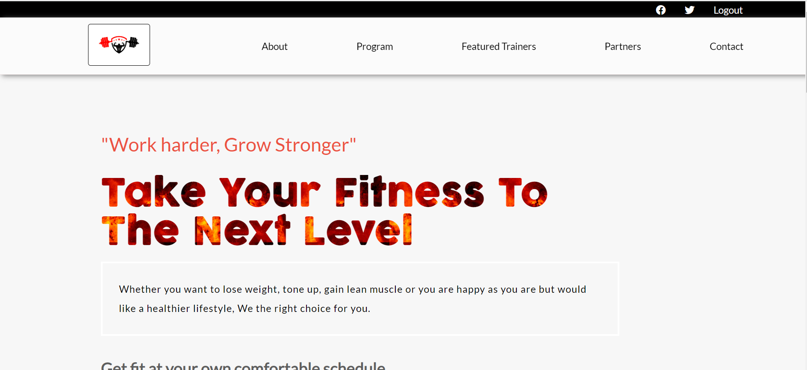
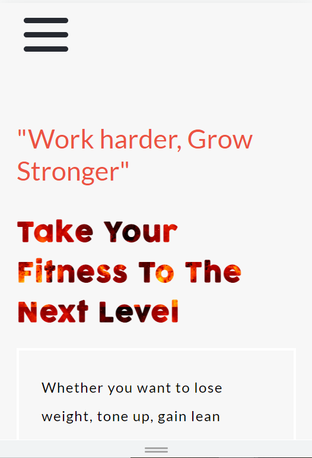
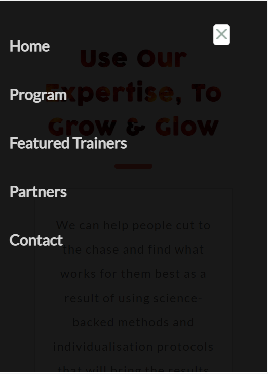

# Fitness Trainer
It's a responsive Fitness Trainer Website

## Screenshots
- The screenshots of desktop and mobile screen as follows





## GitHub Pages Link

- [@View Live](https://ritobrotomukherjee.github.io/capstone-one-fitness/pages)

## Built With

- HTML5
- CSS3
- JavaScript
- Linter

## Getting Started

- NodeJs, npm needs to be installed in system
- For local project set up, run ``` git clone https://github.com/RitobrotoMukherjee/capstone-one-fitness.git ```

## Install

- Run ``` npm install ```

## Page Presentation video
- 

## Authors

👤 **Ritobroto Mukherjee**

- Portfolio: [@Rito](https://ritobrotomukherjee.github.io/Work-Portfolio/)
- GitHub: [@RitobrotoMukherjee](https://github.com/RitobrotoMukherjee)
- Twitter: [@RitobrotoM3](https://twitter.com/RitobrotoM3)
- LinkedIn: [Ritobroto Mukherjee](https://www.linkedin.com/in/ritobroto-mukherjee-519148ba/)


## 🤝 Contributing

Contributions, issues, and feature requests are welcome!

- Feel free to check the [issues page](../../issues/).

## Show your support

Give a ⭐️ if you like this project!

## Acknowledgments

- Microverse: [View Site](https://www.microverse.org/)
- Hat tip to [Cindy Shin](https://www.behance.net/adagio07) whose original design idea was used.

## Code Reviewers

- #